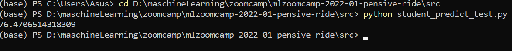
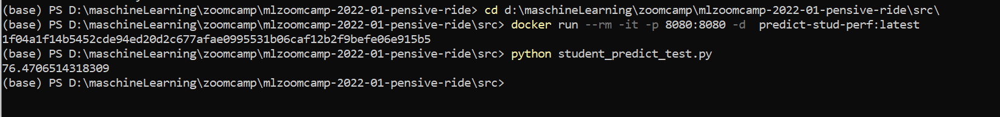

# mlzoomcamp-2022-01-pensive-ride
This is a Midterm project for ML Zoomcamp 2022 (TODO: apply everything we learned)

## Problem description
The aim of this project understand which major factors contribute to test outcomes. 
This problem is very important in our days. The main goal is correctly predict academic performance. 


## Dataset
This project based on [Students Perfomans in Exams](https://www.kaggle.com/datasets/whenamancodes/students-performance-in-exams?resource=download). 
This data set consists of the marks secured by the students in various subjects.

## Description

Project folder contains

* data
* images
* model
* notebooks
  * student_predict.ipynb
  * model-training-and-parameter-tuning.ipynb
  * data_preparation_and_eda.ipynb
* src
  * student_predict_test_dev.py
  * student_predict_test.py
  * model-train.py
* Dockerfile
* Pipfile
* Pipfile.lock
* predict.py
* README.md

## Virtual environment
I used pipenv package manager for create a virtual environment and install the dependencies, 
but you feel free to choose any other tools (conda, venv, etc.).
In case pipenv follow the steps below:
1. Open the terminal and choose the project directory.
2. Install pipenv by command 
```sh
pip install pipenv
```
3. Install all packages with 
```sh
pipenv install
```
This command create virtual environment 
the same as mine using pipfile.lock.
5. Activate this virtual environment by command
```sh
pipenv shell
```
8. 
## Test the service
You can test a model and a service:
1. Open the terminal and choose the project directory.
2. Run the service (development server) by command 
```sh
python predict.py
```
3. Open one more windows with terminal and choose the src folder of project directory.
4. Run the test request with 
```sh
python student_predict_test_dev.py
```
In this file I add one test student. After run this file you can see a predicted academic 
performance for this student.
You can change a features for test student and test for your student. I print a predicted 
performance in terminal.
You see something as this:


Alternatively you can run service with waitress
1. Open the terminal and choose the project directory.
2. Run service with waitress:
```sh
waitress-serve --listen=0.0.0.0:8080 predict:app
```
3. Open one more windows with terminal and choose the src folder of project directory.
4. Run the test request with 
```sh
python student_predict_test.py
```

### Containerization
1. Install the Docker, and it's running on your machine now.
2. Open the terminal and choose the project directory.
3. Build docker image from Dockerfile using 
```sh
docker build -t predict-stud-perf:latest .
```
With `-t` parameter we're specifying the tag name of our docker image. 

3. Now use to run service
```sh
docker run --rm -it -p 8080:8080 -d  predict-stud-perf:latest
``` 
command to launch the docker container with your app. 
You can use the ID image instead of predict-stud-perf:latest. 
You can find ID image with command 
```sh
docker images
```
4. Run student_predict_test.py to see prediction on given data.

After that you will see following:

